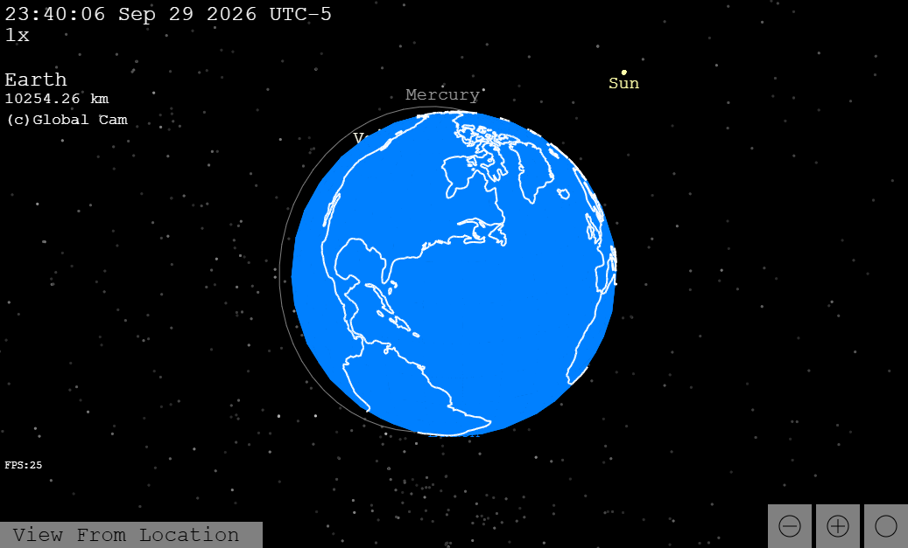

# 3D Planetarium
A planetarium like web app that displays different objects live in the night sky.

[Open Link](https://dspace1015.github.io/space)

 - Live Planet Positions plus moons
 - Location select
 - Track the International Space Station
 - change camera angle to math a planet's axis
 - Predict eclipses by lining up the Earth sun and Moon with the time controls

CONTROLS:

< > / - slow down, speed up, reverse time.

click, drag, and scroll - move camera.

click on object - select object

click twice - go to object

click on icons in the corner to change map position

click on view from location to view ground perspective

(c) change camera mode

(o) toggle orbits

(n) toggle names

(y) toggle light travel time

(t) track object

This project was made(without ai I don't know why it gets flaged as such) using html5's canvas feature in combination with JavaScript. There is no separate engine used for 3d graphics, I wrote my own code to convert the 3d positions to onscreen positions. The planets positions are calculated by using [formule from NASA Horizons]([https://ssd.jpl.nasa.gov/horizons/](https://ssd.jpl.nasa.gov/planets/approx_pos.html)), the calculations involve [Kepler's elements](https://en.wikipedia.org/wiki/Orbital_elements), a method of calculating solutions to [Kepler's equation](https://en.wikipedia.org/wiki/Kepler%27s_equation), and many reference frame changes. All the different reference frames and planet axis should be accounted for. The planetary orbits also correctly precess around their respective Laplace planes, as described in the NASA Horizons website. This means that solar and lunar eclipses can be predicted to within a few hours accuracy (to get full accuracy you would need full ephemeris data from integrating newton's law of gravitation, not just elliptical orbit calculations). This project also allows you to view the ISS's position in real time using the tle file format obtained from [CelesTrak](https://celestrak.org/NORAD/elements/index.php?FORMAT=tle). Full complete accuracy is not guaranteed because 100% accuracy is not possible, but I made sure to be accurate to the best of my ability. Sunrise/set times should be accurate, planetary positions should be accurate enough for amateur nighttime astronomy. 

Credits:

[dspace1015](https://github.com/dspace1015) - Programmer and Designer

[Nasa Horizons](https://ssd.jpl.nasa.gov/horizons/) - Ephemeris for planet orbits

[Justin Kunimune](https://commons.wikimedia.org/wiki/User:Justinkunimune) - For the file used for the Continent outlines-

[sourced here Sept 28 2026](https://commons.wikimedia.org/wiki/File:Plate_Carr%C3%A9e_with_Tissot%27s_Indicatrices_of_Distortion.svg)

[The Henry Draper (HD) catalogue](https://in-the-sky.org/data/catalogue.php?cat=HD&const=1&type=&sort=1&view=1) - Star Data

[CelesTrak](https://celestrak.org/NORAD/elements/index.php?FORMAT=tle) - ISS orbital data

[Time and Date.com](https://www.timeanddate.com/) - Comparing sunrise/set times
